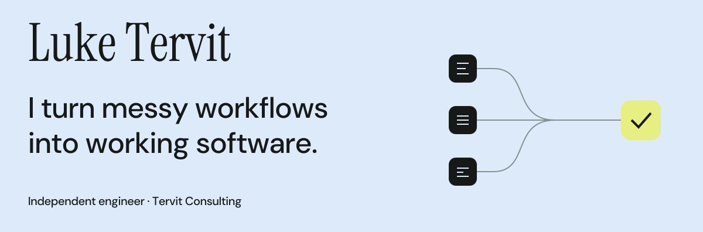

<!--
THESIS: A working engineer's profile, led by current consulting and concrete contributions.
OWN-WORLD: Adapt the personal website's ink, paper, pale blue, yellow and DM Sans; serif name signature.
STORY: Understand Luke's practice, inspect shipped work, explore public code, make contact.
FIRST VIEWPORT: A custom typographic banner with a convergence diagram; native text introduction and direct contact links immediately below.
FORM: GitHub-native single-column portfolio, with responsive SVG artwork. Surface seed 56c0659e; adapted to the existing website identity and GitHub constraints.
FINISH: unreviewed and undocumented is unfinished; this build ends with the finish review, the verdict, DESIGN.md, and every shipping raster carrying its provenance
-->

<picture>
  <source media="(prefers-color-scheme: dark) and (max-width: 600px)" srcset="assets/header-mobile-dark.svg">
  <source media="(max-width: 600px)" srcset="assets/header-mobile-light.svg">
  <source media="(prefers-color-scheme: dark)" srcset="assets/header-dark.svg">
  
</picture>

I run **Tervit Consulting**, an independent software and AI engineering practice based in Edinburgh. I work directly with founders and teams to automate manual work, connect their systems, and build useful AI features into their products.

I take projects from workflow discovery and product design through to implementation. Alongside automation and integrations, I’m working on fraud and identity review interfaces and applied ML research and evaluation.

**[Website](https://luketervit.com)** · **[Email me](mailto:luketervit@gmail.com)** · **[LinkedIn](https://www.linkedin.com/in/luke-tervit/)**

## Selected work

**[Granola](https://granola.ai) · Product engineering** 
As Granola's first Product Engineering Intern, I delivered the **Attio and Zapier integrations** and conceived and built the first version of **Enterprise Visibility**. Work that connected meeting notes to customers' existing tools and helped organisations understand how Granola was being used.

[Attio announcement](https://www.linkedin.com/posts/meetgranola_were-huge-fans-of-attio-at-granola-so-this-activity-7369401552249217027-M7lR) · [Zapier announcement](https://www.linkedin.com/posts/meetgranola_what-if-you-could-automatically-add-to-do-activity-7355631564807938048-o-cp) · [Enterprise Visibility](https://www.granola.ai/blog/series-c)

**[ElectraDx](https://www.electradx.com/) · AI engineering** 
Building an internal pipeline for research data processing, automation and AI-assisted workflows, bringing the data and tools behind the work together.

**[Ahoy](https://www.ahoy.ai/) · Workflow automation** 
Built a LinkedIn prospecting system covering research, enrichment, outreach sequencing and engagement tracking for the go-to-market team.

**[Cullen Property](https://www.cullenproperty.com/) · Discovery & systems design** 
Mapped workflows across five departments and a fragmented spreadsheet estate, then developed an automation roadmap grounded in how the business operates.

---

### A company, built and sold in 20 hours.

I co-founded **The 20 Hour Company** at the Project Lovable hackathon in Stockholm. We built, launched and sold the company to **REVEL for $20k**, all within 20 hours.

[Watch the story](https://www.linkedin.com/posts/antonosika_four-guys-built-and-sold-a-company-with-lovable-ugcPost-7370470948405334017-Dkjz)

## Code you can explore

**[Atharias — social simulation API](https://github.com/luketervit/social-sim-api)** 
A full-stack application for running multi-agent social simulations with psychographic personas. Audience uploads, simulation runs and an API, built with Next.js, Supabase and LLMs.

**[Simulating Political Discourse on X](https://github.com/luketervit/political-discourse-dissertation)** 
My Computer Science dissertation at Edinburgh: combining LLMs with agent-based modelling to generate and evaluate discussion threads. Includes the manuscript, simulation code, ablations and evaluation artefacts.

<strong>Tools I work with</strong>

Python, TypeScript / JavaScript, SQL and Java. React / Next.js and Svelte. PostgreSQL, Supabase, AWS and Docker. LLM integrations, data pipelines, model evaluation and API development.

---

Away from the keyboard, I run the **800m and relays**.

**Have a workflow that needs fixing, or a product that needs building? [Let's talk.](mailto:luketervit@gmail.com)**
